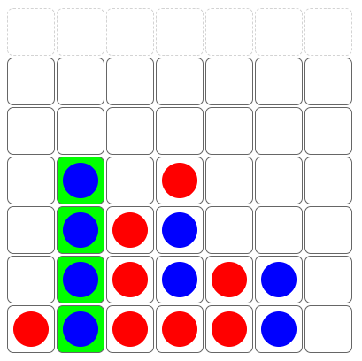

# Connect-Four Game
Connect-four game wherein two players (Red & Blue) take turns dropping pieces down into the gameboard. The first player to connect four of their pieces horizontally, vertically, or diagonally is the winner.

     

## My Contribution
Some skeletal code was provided to me, including generic functions for different tasks, the HTML elements making up the board, and the logic to check for a winner. I had to fill out and complete the functions. I added the styling of the pieces dropping, as well as tweaked the provided logic and created my own function to highlight in green the winning four squares.
